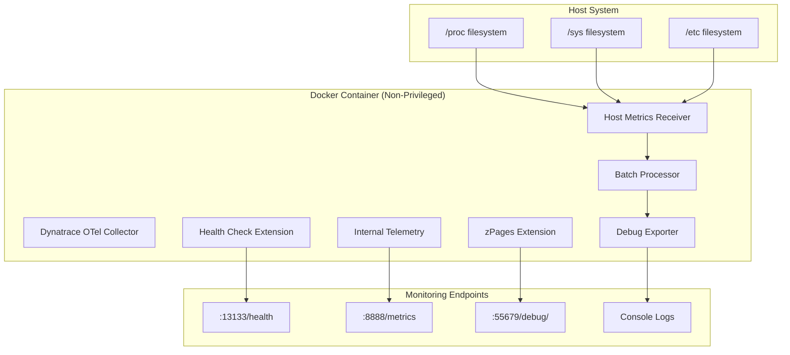

# Architecture Documentation

## Project Structure

Following Docker best practices, this project is organized as follows:

```
dynatrace-otel-collector-docker/
├── config/                     # Configuration files
│   └── collector-config.yaml   # Single collector configuration
├── docs/                       # Comprehensive documentation
│   ├── OVERVIEW.md             # Documentation navigation guide
│   ├── ARCHITECTURE.md         # This file - complete architecture
│   ├── TROUBLESHOOTING.md      # Containerization troubleshooting and telemetry
│   └── MONITORING.md           # Health monitoring and endpoints
├── docker-compose.yml          # Non-privileged container setup
├── README.md                   # Solution overview and quick start
├── CLAUDE.md                   # Development guidance
├── .dockerignore               # Docker build exclusions
└── .gitignore                  # Git exclusions
```

## Component Architecture

### Complete System Architecture



### Data Flow Architecture

1. **Collection Phase**
   - **Host Metrics Receiver**: Scrapes system metrics every 10 seconds
   - **Filesystem Access**: Mounted volumes (`/proc`, `/sys`, `/etc`) provide host data
   - **Metrics Collected**: CPU and memory utilization from host system
   - **Internal Telemetry**: Collector monitors its own performance metrics

2. **Processing Phase**
   - **Batch Processor**: Aggregates metrics for efficient processing
   - **Extension Processing**: Health checks and diagnostic data generation
   - **Telemetry Processing**: Internal performance metrics calculation

3. **Export Phase**
   - **Debug Exporter**: Detailed metric information to console logs
   - **Prometheus Endpoint**: Internal telemetry via HTTP (:8888/metrics)
   - **Health Endpoint**: Simple health status via HTTP (:13133/health)
   - **Diagnostic Interface**: zPages web interface (:55679/debug/)

## Configuration Architecture

### Receiver Configuration
```yaml
receivers:
  hostmetrics:
    collection_interval: 10s    # Metrics collection frequency
    scrapers:
      cpu:                      # CPU utilization metrics
      memory:                   # Memory usage metrics
```

**Design Decisions:**
- **Minimal Scraper Set**: Only CPU and memory to avoid containerization issues
- **10-second Interval**: Balance between data granularity and resource usage
- **No Custom Metrics**: Uses default metric sets for reliability

### Processor Configuration
```yaml
processors:
  batch:                        # Basic batching for efficiency
```

**Design Decisions:**
- **Single Processor**: Minimal processing to reduce complexity
- **Default Batching**: Uses OpenTelemetry defaults for batch size and timeout

### Exporter Configuration
```yaml
exporters:
  debug:
    verbosity: detailed         # Maximum detail for testing
  otlphttp:
    endpoint: ${env:DT_ENDPOINT}
    headers:
      Authorization: "Api-Token ${env:API_TOKEN}"
```

**Design Decisions:**
- **Debug Exporter**: Testing and validation with console output
- **OTLP HTTP Exporter**: Production-ready Dynatrace integration
- **Environment Variables**: Secure credential management via `.env` file
- **Dual Export**: Both debug output and Dynatrace ingestion

### Extensions Configuration
```yaml
extensions:
  health_check:
    endpoint: "0.0.0.0:13133"
    path: "/health"
    response_body:
      healthy: "Collector is healthy"
      unhealthy: "Collector is unhealthy"
  zpages:
    endpoint: "0.0.0.0:55679"
```

### Service Configuration
```yaml
service:
  extensions: [health_check, zpages]
  telemetry:
    metrics:
      level: normal             # Enable internal telemetry
      readers:
        - pull:
            exporter:
              prometheus:
                host: '0.0.0.0'
                port: 8888
    logs:
      level: info              # Enable internal logging
  pipelines:
    metrics:
      receivers: [hostmetrics]
      processors: [batch]
      exporters: [debug, otlphttp]
```

**Design Decisions:**
- **Internal Telemetry Enabled**: Provides collector performance monitoring
- **Health Extensions**: Enable production-ready health checking
- **Diagnostic Interface**: zPages for real-time troubleshooting
- **Prometheus Integration**: Standard metrics format for monitoring systems

## Container Architecture

### Volume Mounts
```yaml
volumes:
  - ./config/collector-config.yaml:/collector.yaml:ro  # Configuration
  - /proc:/host/proc:ro                                # Process info
  - /sys:/host/sys:ro                                  # System info  
  - /etc:/host/etc:ro                                  # Host config
```

**Security Considerations:**
- **Read-only Mounts**: Prevents container from modifying host
- **Minimal Access**: Only necessary filesystem paths mounted
- **Host Network Mode**: Required for accurate host metrics

### Environment Variables
```yaml
environment:
  - HOST_PROC=/host/proc        # Process filesystem path
  - HOST_SYS=/host/sys          # System filesystem path
  - HOST_ETC=/host/etc          # Host configuration path
  - DT_ENDPOINT=${DT_ENDPOINT}  # Dynatrace OTLP endpoint
  - API_TOKEN=${API_TOKEN}      # Dynatrace API token
```

**Purpose:**
- **Host Variables**: Tell the collector where to find host information within container
- **Dynatrace Variables**: Provide secure credential access via environment variables
- **Configuration Security**: Credentials stored in `.env` file, not hardcoded
- **Production Ready**: Standard environment variable pattern for secrets management

### Container Security (Non-Privileged)
```yaml
ports:
  - "8888:8888"   # Internal telemetry metrics endpoint
  - "13133:13133" # Health check endpoint
  - "55679:55679" # zPages diagnostic endpoint
# Removed privileged settings:
# network_mode: host    # Use bridge network instead
# pid: host            # Use container PID namespace
# privileged: true     # Use minimal privileges
```

**Security Improvements:**
- **Non-Privileged Container**: Eliminates privileged access requirements
- **Bridge Networking**: Standard Docker networking instead of host mode
- **Container PID Namespace**: Proper process isolation maintained
- **Port Exposure**: Explicit port mapping for monitoring endpoints
- **Production Ready**: Suitable for security-conscious environments

## Scalability Considerations

### Current Limitations
- Single container deployment
- Limited to CPU and memory metrics
- Debug output only (not persistent storage)

### Future Scaling Options
1. ✅ **Multiple Exporters**: Dynatrace OTLP exporter added alongside debug
2. **Additional Scrapers**: Expand to disk, network, and process metrics
3. **Multiple Instances**: Deploy multiple collectors for different metric sets
4. **Kubernetes DaemonSet**: Scale across cluster nodes

## Security Architecture

### Current Security Posture
- **Privileged Container**: Required for host metrics access
- **Host Network**: Necessary for network metrics collection
- **Read-only Volumes**: Configuration and host data mounted read-only

### Security Recommendations
1. **Principle of Least Privilege**: Evaluate if all privileges are necessary
2. **Network Segmentation**: Consider isolated networks for collector traffic
3. **Secrets Management**: Implement proper secret handling for production
4. **Access Controls**: Restrict who can modify collector configuration

## Monitoring and Observability

### Comprehensive Monitoring Capabilities

#### **Health Monitoring** 
- **Health Check Endpoint**: HTTP endpoint (`:13133/health`) for container orchestration
- **Custom Responses**: Configurable healthy/unhealthy status messages
- **Kubernetes Integration**: Compatible with liveness/readiness probes
- **Docker Health Checks**: Built-in container health validation

#### **Performance Monitoring**
- **Internal Telemetry**: 17 Prometheus metrics on port 8888
- **Key Metrics**: Export success/failure rates, CPU/memory usage, processing throughput
- **Collector Health**: Real-time performance and resource utilization
- **Pipeline Monitoring**: Data flow rates and processing statistics

#### **Diagnostic Monitoring**
- **zPages Interface**: Web-based diagnostic dashboard (`:55679/debug/`)
- **Real-time Insights**: Live pipeline status, component health, performance analysis
- **ServiceZ**: Runtime information and service status
- **PipelineZ**: Data flow visualization and component diagnostics
- **ExtensionZ**: Active extensions and their status

#### **Host Metrics Monitoring**
- **Console Logs**: Debug exporter output via Docker logs
- **CPU Metrics**: Host system CPU utilization and states
- **Memory Metrics**: Host memory usage, limits, and allocation
- **Collection Validation**: Real-time verification of host metrics collection

## Integration Points

### Current Integrations
- **Docker Compose**: Container orchestration
- **Host System**: Direct filesystem access for metrics
- **Console Output**: Human-readable metric display

### Current Integrations
1. **Prometheus Integration**: Internal metrics available for scraping (`:8888/metrics`)
2. **Container Orchestration**: Health endpoints for Kubernetes/Docker integration
3. **Monitoring Systems**: Standard HTTP endpoints for external monitoring
4. **Diagnostic Tools**: zPages web interface for operational troubleshooting

### Future Integration Options
1. ✅ **Dynatrace Platform**: OTLP HTTP exporter integrated alongside debug
2. **Alerting Systems**: Prometheus-based alerting on collector health metrics
3. **Dashboard Integration**: Grafana dashboards for collector performance
4. **Log Aggregation**: Forward internal logs to centralized logging systems
5. **Configuration Management**: GitOps-based configuration deployment

## Development Workflow

### Current Development Process
1. **Configuration Changes**: Modify `config/collector-config.yaml`
2. **Container Restart**: `docker-compose up --build`
3. **Validation**: Review console output via `docker-compose logs`
4. **Iteration**: Repeat until desired metrics are collected

### Recommended Development Practices
1. **Version Control**: Track all configuration changes
2. **Testing**: Validate configurations in development environment
3. **Documentation**: Update architecture docs with changes
4. **Rollback Plan**: Maintain working configuration backups

## References and Sources

This solution was designed based on comprehensive research and analysis of official OpenTelemetry documentation and the Dynatrace OpenTelemetry Collector implementation. The following sources provided critical insights for the architecture:

### **OpenTelemetry Official Documentation**
- **[OpenTelemetry Collector Configuration](https://opentelemetry.io/docs/collector/configuration/)**: Core service configuration and telemetry setup
- **[OpenTelemetry Collector Internal Telemetry](https://opentelemetry.io/docs/collector/internal-telemetry/)**: Prometheus metrics exposure and telemetry levels
- **[OpenTelemetry Collector Troubleshooting](https://opentelemetry.io/docs/collector/troubleshooting/)**: Debugging tools and diagnostic approaches

### **Dynatrace OpenTelemetry Collector**
- **[Dynatrace OTel Collector GitHub](https://github.com/Dynatrace/dynatrace-otel-collector)**: Official Dynatrace distribution and available extensions
- **[Dynatrace OTel Collector Documentation](https://docs.dynatrace.com/docs/ingest-from/opentelemetry/collector)**: Integration guidelines and configuration examples
- **[Configuration Examples](https://github.com/Dynatrace/dynatrace-otel-collector/tree/main/config_examples)**: Reference implementations and patterns

### **OpenTelemetry Extensions**
- **[Health Check Extension](https://github.com/open-telemetry/opentelemetry-collector-contrib/tree/main/extension/healthcheckextension)**: HTTP health endpoint configuration and Kubernetes integration
- **[zPages Extension](https://github.com/open-telemetry/opentelemetry-collector/tree/main/extension/zpagesextension)**: Diagnostic web interface and troubleshooting capabilities
- **[Debug Exporter](https://github.com/open-telemetry/opentelemetry-collector/blob/main/exporter/debugexporter/README.md)**: Console output formatting and verbosity options

### **Additional References**
- **[SigNoz OpenTelemetry Guide](https://signoz.io/blog/opentelemetry-collector-complete-guide/)**: Best practices and production deployment strategies
- **[Host Metrics Receiver](https://github.com/Dynatrace/dynatrace-otel-collector/blob/main/config_examples/host-metrics.yaml)**: Host system metrics collection patterns

### **Key Technical Insights**

#### **Containerization Challenges**
The breakthrough discovery that **privileged container settings interfere with internal telemetry process registration** came from systematic testing and analysis of error patterns in the OpenTelemetry Collector service initialization.

#### **Single Collector Architecture**
The decision to pursue a single collector solution rather than dual collectors was driven by:
- Operational simplicity requirements
- Resource efficiency considerations  
- Reduced architectural complexity
- Easier troubleshooting and maintenance

#### **Security and Functionality Balance**
The solution demonstrates that sophisticated monitoring capabilities don't require privileged container access, achieved through:
- Strategic use of host filesystem mounts
- Non-privileged container configuration
- Standard Docker networking approaches
- Proper port exposure for monitoring endpoints

### **Development Methodology**

This architecture was developed through:
1. **Systematic Problem Analysis**: Deep investigation of process metric registration failures
2. **Iterative Configuration Testing**: Progressive refinement from complex to minimal working configurations  
3. **Comprehensive Documentation Review**: Thorough analysis of OpenTelemetry and Dynatrace documentation
4. **Real-world Validation**: Testing in containerized environments to verify production readiness

The resulting solution provides a robust foundation for OpenTelemetry Collector deployment in containerized environments while maintaining comprehensive observability capabilities.