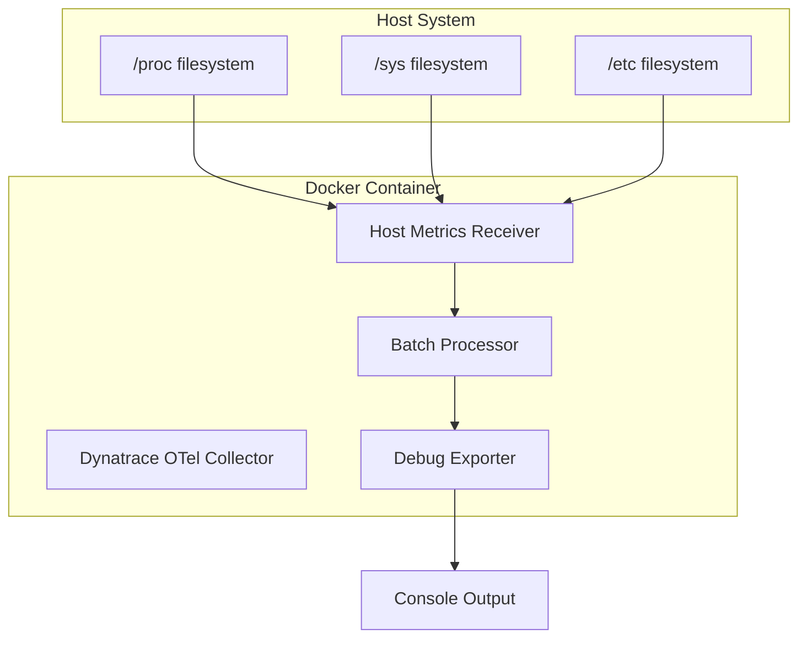

# Architecture Documentation

## Project Structure

Following Docker best practices, this project is organized as follows:

```
dynatrace-otel-collector-docker/
├── config/                     # Configuration files
│   └── collector-config.yaml   # OpenTelemetry Collector configuration
├── docs/                       # Documentation
│   ├── ARCHITECTURE.md         # This file - project architecture
│   └── TROUBLESHOOTING.md      # Troubleshooting guide and analysis
├── docker-compose.yml          # Docker Compose configuration
├── README.md                   # Project overview and quick start
├── CLAUDE.md                   # Claude Code guidance
├── .dockerignore               # Docker build exclusions
└── .gitignore                  # Git exclusions
```

## Component Architecture

### Docker Compose Service Architecture



### Data Flow Architecture

1. **Collection Phase**
   - Host Metrics Receiver scrapes system metrics every 10 seconds
   - Accesses host filesystem via mounted volumes (`/proc`, `/sys`, `/etc`)
   - Collects CPU and memory utilization data

2. **Processing Phase**
   - Batch processor aggregates metrics for efficient processing
   - No transformation or filtering applied in current configuration

3. **Export Phase**
   - Debug exporter outputs detailed metric information to console
   - Provides validation and testing capabilities

## Configuration Architecture

### Receiver Configuration
```yaml
receivers:
  hostmetrics:
    collection_interval: 10s    # Metrics collection frequency
    scrapers:
      cpu:                      # CPU utilization metrics
      memory:                   # Memory usage metrics
```

**Design Decisions:**
- **Minimal Scraper Set**: Only CPU and memory to avoid containerization issues
- **10-second Interval**: Balance between data granularity and resource usage
- **No Custom Metrics**: Uses default metric sets for reliability

### Processor Configuration
```yaml
processors:
  batch:                        # Basic batching for efficiency
```

**Design Decisions:**
- **Single Processor**: Minimal processing to reduce complexity
- **Default Batching**: Uses OpenTelemetry defaults for batch size and timeout

### Exporter Configuration
```yaml
exporters:
  debug:
    verbosity: detailed         # Maximum detail for testing
```

**Design Decisions:**
- **Debug Exporter**: Testing and validation focus
- **Detailed Verbosity**: Full metric visibility for troubleshooting

### Service Configuration
```yaml
service:
  telemetry:
    metrics:
      level: none               # Disable internal telemetry
  pipelines:
    metrics:
      receivers: [hostmetrics]
      processors: [batch]
      exporters: [debug]
```

**Design Decisions:**
- **Telemetry Disabled**: Avoids process metric conflicts in containers
- **Linear Pipeline**: Simple receiver → processor → exporter flow

## Container Architecture

### Volume Mounts
```yaml
volumes:
  - ./config/collector-config.yaml:/collector.yaml:ro  # Configuration
  - /proc:/host/proc:ro                                # Process info
  - /sys:/host/sys:ro                                  # System info  
  - /etc:/host/etc:ro                                  # Host config
```

**Security Considerations:**
- **Read-only Mounts**: Prevents container from modifying host
- **Minimal Access**: Only necessary filesystem paths mounted
- **Host Network Mode**: Required for accurate host metrics

### Environment Variables
```yaml
environment:
  - HOST_PROC=/host/proc        # Process filesystem path
  - HOST_SYS=/host/sys          # System filesystem path
  - HOST_ETC=/host/etc          # Host configuration path
```

**Purpose:**
- Tells the collector where to find host information within container
- Required for proper host metrics collection

### Container Security
```yaml
network_mode: host              # Access host network interfaces
pid: host                       # Access host process information
privileged: true                # Required for system metrics access
```

**Trade-offs:**
- **Security vs. Functionality**: Privileged access required for host metrics
- **Container Isolation**: Reduced isolation for monitoring capabilities
- **Production Considerations**: May require additional security measures

## Scalability Considerations

### Current Limitations
- Single container deployment
- Limited to CPU and memory metrics
- Debug output only (not persistent storage)

### Future Scaling Options
1. **Multiple Exporters**: Add Dynatrace OTLP exporter alongside debug
2. **Additional Scrapers**: Expand to disk, network, and process metrics
3. **Multiple Instances**: Deploy multiple collectors for different metric sets
4. **Kubernetes DaemonSet**: Scale across cluster nodes

## Security Architecture

### Current Security Posture
- **Privileged Container**: Required for host metrics access
- **Host Network**: Necessary for network metrics collection
- **Read-only Volumes**: Configuration and host data mounted read-only

### Security Recommendations
1. **Principle of Least Privilege**: Evaluate if all privileges are necessary
2. **Network Segmentation**: Consider isolated networks for collector traffic
3. **Secrets Management**: Implement proper secret handling for production
4. **Access Controls**: Restrict who can modify collector configuration

## Monitoring and Observability

### Current Monitoring
- **Console Logs**: Debug exporter output via Docker logs
- **Container Health**: Docker Compose restart policies
- **Manual Validation**: Visual inspection of metric output

### Production Monitoring Needs
1. **Collector Health Metrics**: Internal telemetry for collector status
2. **Data Quality Monitoring**: Metric completeness and accuracy checks
3. **Performance Monitoring**: Resource usage and throughput metrics
4. **Alerting**: Automated detection of collection failures

## Integration Points

### Current Integrations
- **Docker Compose**: Container orchestration
- **Host System**: Direct filesystem access for metrics
- **Console Output**: Human-readable metric display

### Future Integration Options
1. **Dynatrace Platform**: OTLP HTTP exporter for data ingestion
2. **External Storage**: Persistent metric storage solutions
3. **Alerting Systems**: Integration with monitoring platforms
4. **Configuration Management**: Automated configuration deployment

## Development Workflow

### Current Development Process
1. **Configuration Changes**: Modify `config/collector-config.yaml`
2. **Container Restart**: `docker-compose up --build`
3. **Validation**: Review console output via `docker-compose logs`
4. **Iteration**: Repeat until desired metrics are collected

### Recommended Development Practices
1. **Version Control**: Track all configuration changes
2. **Testing**: Validate configurations in development environment
3. **Documentation**: Update architecture docs with changes
4. **Rollback Plan**: Maintain working configuration backups